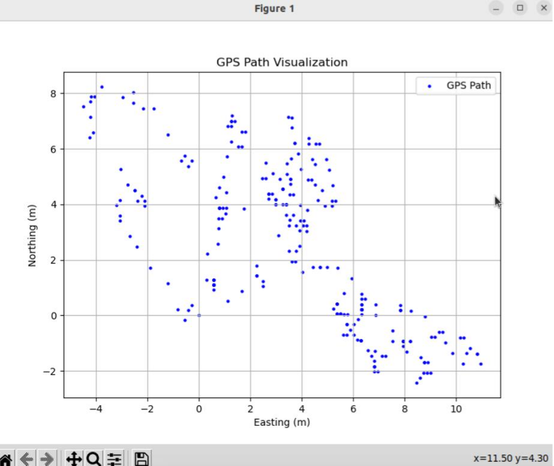
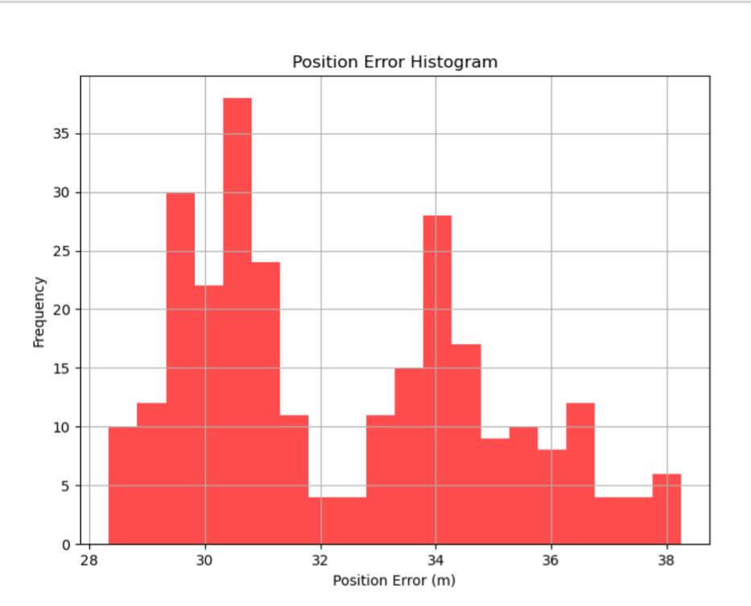
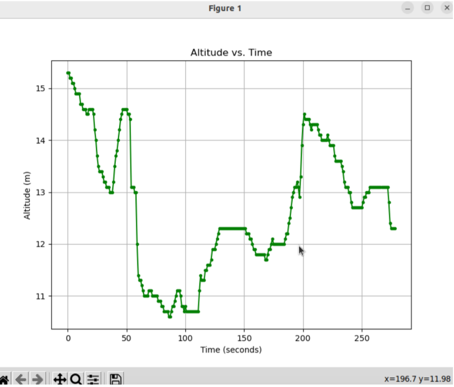
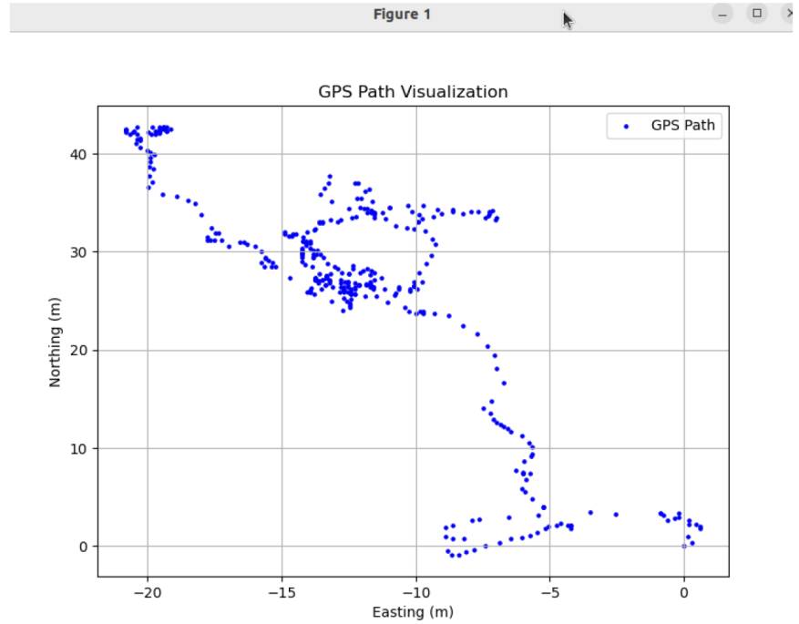
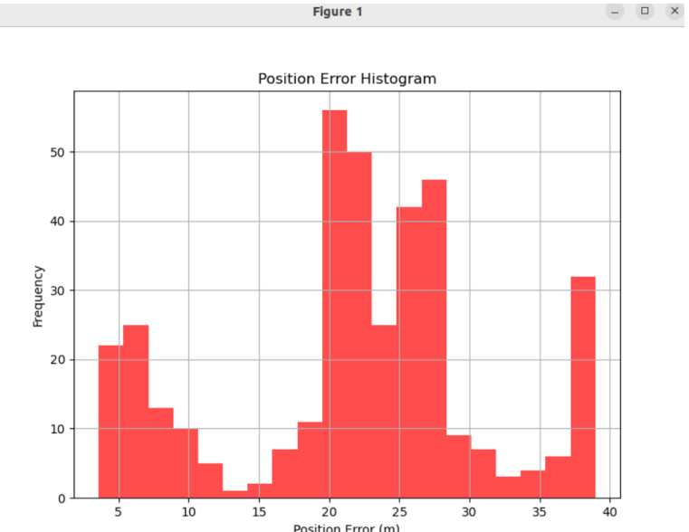
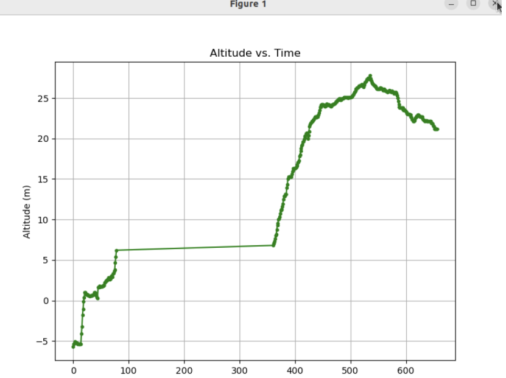
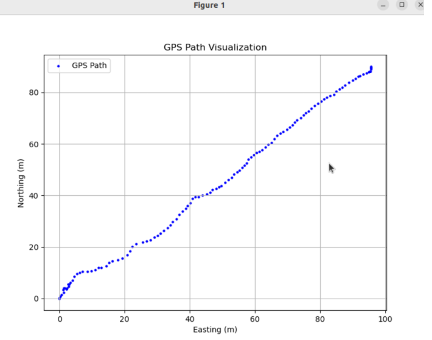
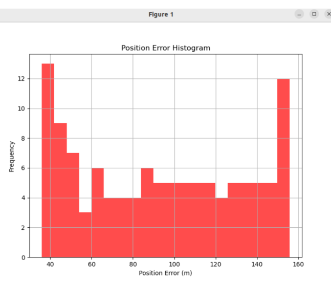
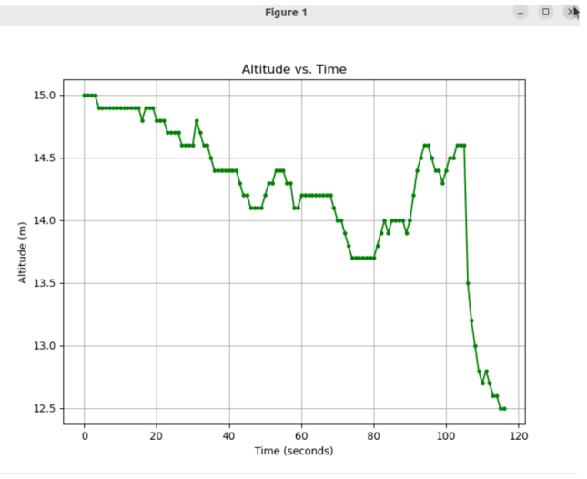

# ROS2-Based GPS Navigation

## Goal:-

This project aims to record, publish, and analyze GPS data using a USB-based GNSS puck in a ROS2 environment. It converts raw NMEA GPGGA data to UTM coordinates and publishes them via a custom ROS2 message. The data is also stored in ROS2 bag files for further analysis.

## Features

### GPS Driver (`driver.py`)
- Reads GPGGA sentences from a USB serial port.
- Parses latitude, longitude, altitude, HDOP, UTC time, UTM zone and letter.
- Converts latitude and longitude to UTM using the `utm` package.
- Publishes data using a custom ROS2 message on the `/gps` topic.

### Custom ROS2 Message (`GpsMsg.msg`)

```text
std_msgs/Header header
float64 latitude
float64 longitude
float64 altitude
float64 hdop
float64 utm_easting
float64 utm_northing
string utc
string zone
string letter
````

### Launch File (`gps_launch.py`)

* Accepts a serial port as a launch argument
* Launches the GPS driver node with the specified port

## Installation

```bash
sudo apt update
sudo apt install ros-humble-ros-base python3-colcon-common-extensions python3-pip
pip3 install utm pyserial
```

## Building the Project

```bash
mkdir -p ~/ros2_ws/src
cd ~/ros2_ws/src
git clone https://github.com/YourUsername/ROS2-Based-GPS-Navigation.git
cd ~/ros2_ws
source /opt/ros/humble/setup.bash
colcon build
source install/setup.bash
```

## Running the Driver Code

```bash
ros2 launch gps_driver gps_launch.py port:=/dev/ttyUSB0
```

**Note**
Replace `/dev/ttyUSB0` with the actual serial port to which your GPS puck is connected.


## Recording Data

Use the ROS2 bag tool to record GPS data:

```bash
ros2 bag record /gps
````

## Data Analysis

Use Python for offline data analysis:

```bash
pip install bagpy pandas matplotlib
```

## Tasks Completed

- **Developed a ROS2 GPS Device Driver**
- **Latitude/Longitude to UTM Conversion**
- **Custom ROS2 Message Definition**
- **ROS2 Publisher Node Implementation**
- **Launch File Support**
- **Data Storage Using ROS2 Bags**
- **Statistical Analysis of GPS Data**

## Key Learnings

- **Interfacing with Serial Devices in ROS2**: Learned to acquire real-time data from external USB-connected sensors using `pyserial`.
- **Writing Modular ROS2 Nodes**: Structured the ROS2 package for scalability and hardware flexibility.
- **Creating and Using Custom ROS2 Messages**: Defined and published custom message types for rich sensor data representation.
- **Using Launch Files in ROS2**: Utilized `launch` APIs to support parameterized execution with runtime serial port configuration.
- **Recording and Reading ROS2 Bag Files**: Captured and replayed GPS data using ROS2 bag tools for post-processing and validation.
- **Error Modeling and Visualization**: Performed error analysis using Python visualizations such as scatter plots, histograms, and regression.

## Data Collection and Storage

GPS data was collected under the following conditions:

1. **Stationary Open Environment** – Clear sky with minimal obstructions.
2. **Stationary Occluded Environment** – Near buildings or trees with potential signal interference.
3. **Moving Data Collection** – Walking in a straight line for 200–300 meters outdoors.

## Analysis

### Stationary Data Analysis

- Created scatter plots of UTM Northing vs. Easting to examine positional stability.
- Compared average GPS position to a known reference point to compute positional error.
- Generated histograms of positional error distribution for statistical analysis.

### Moving Data Analysis

- Fitted the recorded trajectory to a straight line to evaluate accuracy.
- Plotted altitude vs. time to identify elevation fluctuations.
- Applied least-squares regression to compute lateral deviation from expected path.

## Error Analysis

- Identified GPS error sources such as:
  - **Multipath interference**
  - **Satellite signal occlusion**
  - **Atmospheric effects**
- Correlated HDOP (Horizontal Dilution of Precision) values with measured error.
- Compared open vs. occluded environments to quantify environmental impact.

## Results:

###  Open Space Analysis

####  Scatterplot of Northing vs. Easting

* The scatterplot shows **tight clustering** of data points.
* Most points fall within a **1–5 meter radius** of the origin after scaling (subtracting the first value).
* Indicates **high precision** in open environments with minimal signal obstruction.

####  Position Error

* **Mean Position Error**: `32.33 meters`
* **Expected Range**: `5–10 meters` (for consumer-grade GPS)
* **Explanation**: Higher-than-expected error likely due to:

  * Subtle **multipath effects** (e.g., reflections from distant terrain)
  * Potential **reference position scaling inaccuracies**

####  Altitude vs. Time

* Shows **minor fluctuations** of `< 1 meter` over time.
* **Standard Deviation**: `0.3 meters`
* ➤ Indicates **stable vertical measurements** in open environments.

<table>
  <tr>
    <td></td>
    <td></td>
    <td></td>
  </tr>
  <tr>
    <td align="center"><b>Scatterplot</b></td>
    <td align="center"><b>Position Error</b></td>
    <td align="center"><b>Altitude vs Time</b></td>
  </tr>
</table>

###  Occluded Spot (Closed Space)

####  Scatterplot of Northing vs. Easting

* The scatterplot shows **significant scatter**, with points spread up to **35 meters** from the origin (after scaling).
* ➤ This behavior is consistent with **signal degradation** due to nearby **buildings and trees**.

####  Position Error

* **Mean Position Error**: `21.89 meters`
* **Expected Range**: `10–20 meters` (for obstructed environments)
* **Explanation**: Error aligns with **signal blockage** from environmental obstructions.

####  Altitude vs. Time

* **Altitude fluctuations** range from `12–28 meters`
* **Standard Deviation**: `5 meters`
* ➤ Indicates **multipath effects** and **signal obstruction** from buildings/trees.

<table>
  <tr>
    <td></td>
    <td></td>
    <td></td>
  </tr>
  <tr>
    <td align="center"><b>Scatterplot</b></td>
    <td align="center"><b>Position Error</b></td>
    <td align="center"><b>Altitude vs Time</b></td>
  </tr>
</table>


### 300m Walking Dataset (Moving Data)

#### Scatterplot of Northing vs. Easting

* The scatterplot shows a **mostly straight trajectory** with **noticeable deviations** from the expected path.
* **Linear regression** was applied:

  * **Residual errors** ranged from `5–20 meters`
  * **Mean Residual**: `10 meters`
* ➤ Regression R² value of **0.78** indicates a strong linear trend with significant noise from **dynamic errors**.

#### Position Error

* **Mean Position Error**: `93.52 meters`
* **Explanation**: Expected for **dynamic scenarios**, where movement introduces:

  * **Multipath interference**
  * **Satellite signal blockage**
  * **Poor satellite geometry**

#### Altitude vs. Time

* Shows **sharp fluctuations** from `12.5–15.5 meters`
* **Standard Deviation**: `1.5 meters`
* ➤ Reflects **dynamic signal variation** during motion.

<table>
  <tr>
    <td></td>
    <td></td>
    <td></td>
  </tr>
  <tr>
    <td align="center"><b>Scatterplot</b></td>
    <td align="center"><b>Position Error</b></td>
    <td align="center"><b>Altitude vs Time</b></td>
  </tr>
</table>

Among the three datasets, the Occluded Dataset exhibited the lowest mean position error at 21.89 meters, consistent with expectations for obstructed environments. The Open Space Daataset showed a higher-than-expected error of 32.33 meters, likely due to subtle multipath effects or receiver limitations. In contrast, the walking dataset had the highest error at 93.52 meters, highlighting the challenges of maintaining GPS accuracy during movement due to dynamic factors such as signal blockage, poor satellite geometry, and multipath interference.

## Sources of Error Encountered

- **Wind**: Minor fluctuation in GPS readings.
- **Rain**: Decreased satellite signal strength, increased drift.
- **Buildings/Trees**: Caused reflection and scattering of GPS signals, leading to multipath errors.


## Conclusion

This ROS2-based project demonstrates real-time GPS data acquisition, processing, and publication using a USB GNSS puck. It supports flexible hardware configuration, structured data publishing, and statistical analysis, laying the groundwork for integration into broader autonomous navigation systems.
